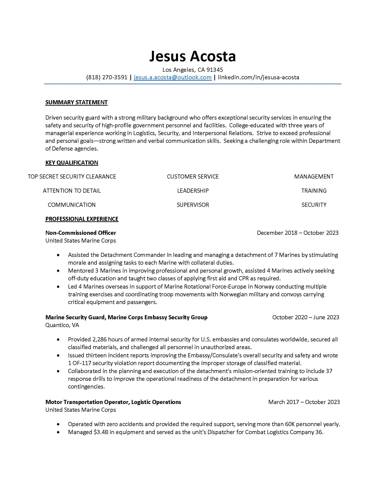
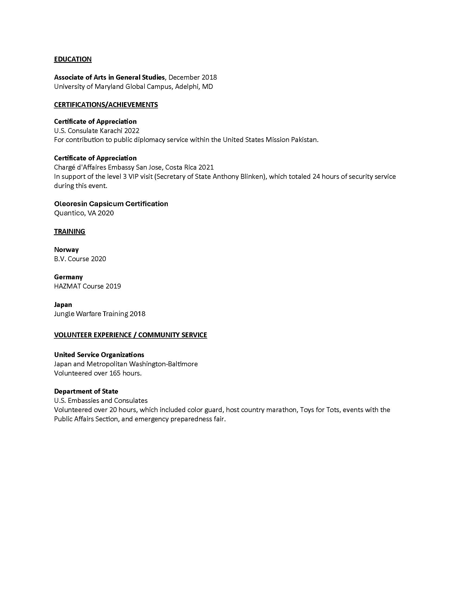

<html lang="en">
<head>
  <meta charset="UTF-8">
  
  </head>
  <body>
   <h1>Hi, I'm Jesus Acosta, a full-time business student from Los Angeles, CA. Empowering veterans through business growth and mentorship.  Welcome to my Homepage!</h1>
  <h4>Connect with Me</h4>

 <h3>
  <a href="https://www.linkedin.com/in/jesusa-acosta/">LinkedIn</a>
&nbsp;&nbsp;&nbsp;&nbsp;&nbsp;&nbsp;&nbsp;&nbsp;<a href="https://msmu.instructure.com/eportfolios/130502/Home">Canvas ePortfolio</a>
&nbsp;&nbsp;&nbsp;&nbsp;&nbsp;&nbsp;&nbsp;&nbsp;<a href="https://www.instagram.com/jesusaa03/">Instagram</a>
&nbsp;&nbsp;&nbsp;&nbsp;&nbsp;&nbsp;&nbsp;&nbsp;<a href="https://www.tiktok.com/@jesusaa03">TikTok</a> 
   </h3>
     
    

    

   
    © 2024 Jesus Acosta. All Rights Reserved. 
    <map name="Map1" id="Map1">
      <area shape="rect" coords="5,29,137,88" alt="fr"
            href="https://jaal32.github.io/freedom" title="Freedom" >
      <area shape="rect" coords="223,29,357,88" alt="fa"
            href="https://jaal32.github.io/factoring" title="Factoring" >
      <area shape="rect" coords="441,29,573,88" alt="r"
            href="https://jaal32.github.io/rights" title="Rights" >
      <area shape="rect" coords="660,29,796,88" alt="b"
            href="https://jaal32.github.io/bio" title="Bio" >
      <area shape="rect" coords="314,125,449,181" alt="t"
            href="topic" >
      <area shape="rect" coords="114,217,246,275" alt="bm"
            href="biography" title="Bio in Markdown" >
      <area shape="rect" coords="315,217,447,275" alt="h"
            href="home" />
      <area shape="rect" coords="518,217,651,275" alt="t"
            href="travel" title="Travel in Markdown" />
    </map>

</body>
</html>
